<style>
blockquote p, blockquote ul, blockquote ol { font-size: 10pt; }
input[type="radio"] { margin: 0 0 4px 0; height: 10px; }
select {
    margin: 0 0 4px 0;
    padding: 0;
    height: 22px;
}
</style>

```{r load libraries, echo=F, message=F, warning=F}
library(ggplot2)
library(dplyr)
library(tidyr)
library(grid)
library(ggthemes)
library(languageR)
library(psych)
library(diagram)
options(digits=3)

### my utils (TODO: make script with this stuff)
printp = function(p) {
  if (p<0.001) {
    return('p<0.001')
  } else {
    return(sprintf('p=%.3f', p))
  }
}

printmodelcomp = function(rs) {
  p = rs[['Pr(>F)']][2]
  if (p>0.05) {
    printp(p)
  } else {
    return(paste(
      sprintf('F(%.0f,', rs$Df[2]),
      sprintf('%.0f)', rs$Res.Df[2]),
      sprintf('=%.3f', rs$F[2]),
      ', ',
      printp(p),
      sep=''
    ))
  }
}

printanova = function(rs) {
  p = rs[['Pr(>F)']][1]
  if (p<0.05) {
    return(paste(
      sprintf('F(%.0f,', rs$Df[1]),
      sprintf('%.0f)', rs$Df[2]),
      sprintf('=%.3f', rs$F[1]),
      ', ',
      printp(p),
      sep=''
    ))
  } else {
    return(printp(p))
  }
}

printcoef = function(rs, coef) {
  p = summary(rs)$coefficients[coef, "Pr(>|t|)"]
  if (p<0.05) {
    return(paste(
      sprintf('b=%.3f', rs$coefficients[[coef]]),
      ', ',
      sprintf('t(%.0f)', rs$df),
      sprintf('=%.3f', summary(rs)$coefficients[coef, 't value']),
      ', ',
      printp(p), sep=''
    ))
  } else {
    return(printp(p))
  }
}

bootCI = function(r) { return(boott(r, mean, nboott=1000)$confpoints[1,c('0.025', '0.975')]) }
bootCIstr = function(r) { return(paste(bootCI(r), collapse=' ')) }
bootlow = function(r) {return(as.numeric(sapply(r, function(s) {return(strsplit(s, ' ')[[1]][1])})))}
boothigh = function(r) {return(as.numeric(sapply(r, function(s) {return(strsplit(s, ' ')[[1]][2])})))}

# Multiple plot function
#
# ggplot objects can be passed in ..., or to plotlist (as a list of ggplot objects)
# - cols:   Number of columns in layout
# - layout: A matrix specifying the layout. If present, 'cols' is ignored.
#
# If the layout is something like matrix(c(1,2,3,3), nrow=2, byrow=TRUE),
# then plot 1 will go in the upper left, 2 will go in the upper right, and
# 3 will go all the way across the bottom.
#
multiplot <- function(..., plotlist=NULL, file, cols=1, layout=NULL) {
  library(grid)

  # Make a list from the ... arguments and plotlist
  plots <- c(list(...), plotlist)

  numPlots = length(plots)

  # If layout is NULL, then use 'cols' to determine layout
  if (is.null(layout)) {
    # Make the panel
    # ncol: Number of columns of plots
    # nrow: Number of rows needed, calculated from # of cols
    layout <- matrix(seq(1, cols * ceiling(numPlots/cols)),
                    ncol = cols, nrow = ceiling(numPlots/cols))
  }

 if (numPlots==1) {
    print(plots[[1]])

  } else {
    # Set up the page
    grid.newpage()
    pushViewport(viewport(layout = grid.layout(nrow(layout), ncol(layout))))

    # Make each plot, in the correct location
    for (i in 1:numPlots) {
      # Get the i,j matrix positions of the regions that contain this subplot
      matchidx <- as.data.frame(which(layout == i, arr.ind = TRUE))

      print(plots[[i]], vp = viewport(layout.pos.row = matchidx$row,
                                      layout.pos.col = matchidx$col))
    }
  }
}

visualize_questionnaire = function(df) {
  print('comments:')
  print(levels(df$comments))
  print(paste('number of participants: ', length(unique(df$workerid))))
  ageplot = ggplot(df, aes(x=age)) + geom_histogram(binwidth=5) +
    theme_few() + xlim(0,100)
  langplot = ggplot(df, aes(x=language, fill=language)) + geom_bar() +
    theme_few() + scale_fill_brewer(type='qual', palette=6)
  enjoyplot = ggplot(df, aes(x=enjoyment)) + geom_histogram(binwidth=0.5) +
    theme_few() + xlim(-1,3)
  eduplot = ggplot(df, aes(x=education)) + geom_histogram(binwidth=0.5) +
    theme_few() + xlim(-1,5)
  genderplot = ggplot(df, aes(x=gender, fill=gender)) + geom_bar() +
    theme_few() + scale_fill_brewer(type='qual', palette=6)
  assessplot = ggplot(df, aes(x=assess, fill=assess)) + geom_bar() +
    theme_few() + scale_fill_brewer(type='qual', palette=6)
  timeplot = ggplot(df, aes(x=time_to_complete)) + geom_histogram(binwidth=1) + theme_few()
  df$hourly_rate = df$reward/df$time_to_complete*60
  rateplot = ggplot(df, aes(x=hourly_rate)) + geom_histogram(binwidth=1) + theme_few()
  multiplot(ageplot, langplot, eduplot, genderplot, enjoyplot, assessplot,
            timeplot, rateplot, cols=2)
}
graph = function(df) {
  p = df %>% gather('source', 'number', 8:11) %>%
    mutate(source = as.character(source),
           statistic = factor(sapply(source, function(str) {return(strsplit(str, split='_')[[1]][2])})),
           source = factor(sapply(source, function(str) {return(strsplit(str, split='_')[[1]][1])}))) %>%
    spread(statistic, number) %>%
    ggplot(aes(x=variable, y=response, colour=source, group=source)) +
    geom_point(size=3) +
    geom_line() +
    ylim(0, 1) +
    facet_wrap(~ story) +
    geom_hline(y=0.5, linetype='dotted') +
    geom_errorbar(aes(x=variable,
                      ymin=response-2*sd/sqrt(labN+turkN),
                      ymax=response+2*sd/sqrt(labN+turkN)),
                  width=0) +
    theme_few() + scale_colour_few()
  print(p)
}
frompixel = function(response.pixels, pixel0, pixel1) {
  return(round((response.pixels - pixel0)/(pixel1 - pixel0), 2))
}
```

A replication of [Lucas & Kemp, 2015](http://philpapers.org/archive/LUCAIP.pdf), including additional conditions with explanations.

## Basic method

#### First slide (my words):

We will give you descriptions of different labs that are studying hormones in rats.

Different labs are studying different hormones, so the hormone that one lab calls "A" will not be the same hormone that another lab calls "A".

#### Subsequent slides:

Present short story.

In random order, present questions.

e.g.

> If hormone A were observed to be absent, would hormone A be present? <br/>
> <input type='radio' name='response' value='yes'>Yes <br/>
> <input type='radio' name='response' value='no'>No <br/>
> <br/>
> How confident are you in your answer? <br/>
> <input type='radio' name='confidence' value='1'>Not at all confident <br/>
> <input type='radio' name='confidence' value='2'> <br/>
> <input type='radio' name='confidence' value='3'> <br/>
> <input type='radio' name='confidence' value='4'> <br/>
> <input type='radio' name='confidence' value='5'> <br/>
> <input type='radio' name='confidence' value='5'>Completely confident

L&K converted these ratings to subjective probabilities by treating "Not at all confident" responses as 0.5 and linearly interpolating between 0.5 and either 0 or 1, where the direction of interpolation depended on the answer to the yes/no question.

#### Last slide:

To get prior probabilities, at the end of each experiment, L&K asked,

> How many, out of 100 mice, does 'a very small number' correspond to?

and rounded the median to the nearest multiple of 5.

These kinds of questions were included as attention checks:

* If you had observed hormone A to be present, would hormone A be present?

Participants who answered these questions incorrectly were excluded.

## Causal stories

### Story 1: no relation, observation

#### Causal structure

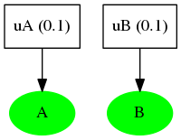
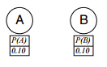

#### Background (story)

##### {{Tondam}} Lab

The {{Tondam}} Lab is studying hormones in rats.
They found two hormones in their rats and called them hormone A and hormone B.

> In a very small number of the mice, hormone A is present.
>
> In a very small number of the mice, hormone B is present.
>
> The presence or absence of hormone A does not depend on the status of hormone B.
> 
> The presence or absence of hormone B does not depend on the status of hormone A.
> 
> {{Fred}} is a mouse from the {{Tondam}} Lab. You test {{Fred}} and find that:
>
> * Hormone A is definitely present.
> * Hormone B is definitely present.

#### Questions

* For {{Fred}} the mouse, if you had observed A to be absent, would A be present?
* For {{Fred}} the mouse, if you had observed A to be absent, would B be present?

#### L&K original findings

```{r echo=F, fig.width=5, fig.height=3}
data.frame(
  story = c('story1', 'story1'),
  labN.before.exclusion = 55,
  labN = 30,
  turkN.before.exclusion = 56,
  turkN = 34,
  condition = c('A=F', 'A=F'),
  variable = c('A', 'B'),
  data_response = c(0, 0.53),
  data_sd = c(0, 0.31), #participants were excluded if they said anything other than 0.
  model_response = frompixel(response.pixels=c(449, 254), pixel0=449, pixel1=112),
  model_sd = c(0, 0)
) %>% graph(.)
```

#### Replication results

#### "Replication" with explanations

* For {{Fred}} the mouse, B is present because  <select>
  <option value="nothing">none of these</option>
  <option value="A">A is present</option>
  <option value="B">B is present</option>
</select>.
* For {{Fred}} the mouse, A is present because  <select>
  <option value="nothing">none of these</option>
  <option value="A">A is present</option>
  <option value="B">B is present</option>
</select>.

(base counterfactual)

### Story 2: causal chain

#### Causal structure

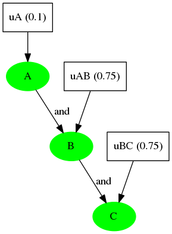
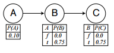

#### Background (story)

##### {{Nanber}} Lab

The {{Nanber}} Lab is studying hormones in rats.
They found three hormones in their rats and called them hormone A, hormone B, and hormone C.

> In almost all of the mice, hormone A is absent.
> 
> The status of hormone B is caused by the status of hormone A and nothing else.
> 
> In many of the mice, if A is present, this causes B to be present.
> 
> The status of hormone C is caused by the status of hormone B and nothing else.
> 
> In many of the mice, if B is present, this causes C to be present.
> 
> {{Frank}} is a mouse from the {{Nanber}} Lab. You test {{Frank}} and find that:
> 
> * Hormone A is definitely present.
> * Hormone B is definitely present.
> * Hormone C is definitely present.

#### Questions

* For {{Frank}} the mouse, if you had observed B to be absent, would A be present?
* For {{Frank}} the mouse, if you had observed B to be absent, would B be present?
* For {{Frank}} the mouse, if you had observed B to be absent, would C be present?

#### L&K original findings

```{r echo=F, fig.width=5, fig.height=3}
data.frame(
  story = c('story2', 'story2', 'story2'),
  labN.before.exclusion = 55,
  labN = 30,
  turkN.before.exclusion = 56,
  turkN = 34,
  condition = c('B=F', 'B=F', 'B=F'),
  variable = c('A', 'B', 'C'),
  data_response = frompixel(response.pixels=c(306, 401, 347), pixel0=410, pixel1=74),
  data_sd = c(0), #participants were excluded if they said anything other than 0.
  model_response = frompixel(response.pixels=c(364, 410, 410), pixel0=410, pixel1=74),
  model_sd = c(0)
) %>% graph(.)
```

#### Replication results

* For {{Frank}} the mouse, A is present because <select>
  <option value="nothing">none of these</option>
  <option value="A">A is present</option>
  <option value="B">B is present</option>
  <option value="C">C is present</option>
</select>.
* For {{Frank}} the mouse, B is present because <select>
  <option value="nothing">none of these</option>
  <option value="A">A is present</option>
  <option value="B">B is present</option>
  <option value="C">C is present</option>
</select>.
* For {{Frank}} the mouse, C is present because <select>
  <option value="nothing">none of these</option>
  <option value="A">A is present</option>
  <option value="B">B is present</option>
  <option value="C">C is present</option>
</select>.

#### "Replication" with explanations

### Story 3: simple

#### Causal structure

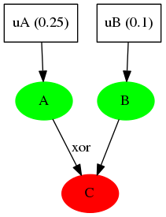
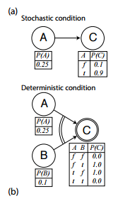

#### Background (story) A: stochastic

> ##### {{Gostak}} Lab
>
> The {{Gostak}} Lab is studying hormones in rats.
> They found two hormones in their rats and called them hormone A and hormone B.
>
> In some of the mice, hormone A is present.
>
> The status of hormone B is caused by the status of hormone A and nothing else.
>
> In a very small number of the mice, if A is present, this causes B to be absent, and if A is absent, this causes B to be present.
>
> In the remaining mice, if A is present, this causes B to be present, and if A is absent, this causes B to be absent.
>
> {{Ronald}} is a mouse from the {{Gostak}} Lab. You test {{Ronald}} and find that:
>
> * Hormone A is definitely present.
> * Hormone B is definitely not present.

#### Questions A

* For {{Ronald}} the mouse, if A were absent, would A be present?
* For {{Ronald}} the mouse, if A were absent, would B be present?

#### Background (story) B: deterministic

> ##### {{Muckenhoupt}} Lab
>
> The {{Muckenhoupt}} Lab is studying hormones in rats.
> They found three hormones in their rats and called them hormone A, hormone B, and hormone C.
>
> In some of the mice, hormone A is present.
>
> In a very small number of the mice, hormone B is present.
>
> The status of hormone C is caused by the status of hormones A and B and nothing else.
>
> If B is absent, this causes C’s status to match A’s: if A is present, this causes C to be present, and if A is absent, this causes C to be absent.
>
> If B is present, this causes C’s status to be the opposite of A’s: if A is present, this causes C to be absent, and if A is absent, this causes C to be present.
>
> {{Florence}} is a mouse from the {{Muckenhoupt}} Lab.
>
> You test {{Florence}} and find that:
>
> * Hormone A is definitely present.
> * Hormone C is definitely not present.

#### Questions B

* For {{Florence}} the mouse, if A were absent, would A be present?
* For {{Florence}} the mouse, if A were absent, would B be present?
* For {{Florence}} the mouse, if A were absent, would C be present?

#### L&K original findings

```{r echo=F, fig.width=5, fig.height=3}
data.frame(
  story = c('story3a', 'story3a', 'story3b', 'story3b', 'story3b'),
  labN.before.exclusion = 55,
  labN = 30,
  turkN.before.exclusion = 56,
  turkN = 34,
  condition = c('A=F', 'A=F', 'A=F', 'A=F', 'A=F'),
  variable = c('A', 'C', 'A', 'B', 'C'),
  data_response = frompixel(response.pixels=c(426, 236, 420, 296, 207), pixel0=435, pixel1=99),
  data_sd = c(0), #participants were excluded if they said anything other than 0.
  model_response = frompixel(response.pixels=c(435, 240, 435, 240, 240), pixel0=435, pixel1=99),
  model_sd = c(0)
) %>% graph(.)
```

#### Replication results

* For {{Ronald}} the mouse, B is not present because <select>
  <option value="nothing">none of these</option>
  <option value="A">A is present</option>
  <option value="C">B is not present</option>
</select>.
* For {{Ronald}} the mouse, A is present because <select>
  <option value="nothing">none of these</option>
  <option value="A">A is present</option>
  <option value="C">B is not present</option>
</select>.

* For {{Florence}} the mouse, A is present because <select>
  <option value="nothing">none of these</option>
  <option value="A">A is present</option>
  <option value="B">B is present</option>
  <option value="C">C is not present</option>
</select>.
* For {{Florence}} the mouse, B is present because <select>
  <option value="nothing">none of these</option>
  <option value="A">A is present</option>
  <option value="B">B is present</option>
  <option value="C">C is not present</option>
</select>.
* For {{Florence}} the mouse, C is not present because <select>
  <option value="nothing">none of these</option>
  <option value="A">A is present</option>
  <option value="B">B is present</option>
  <option value="C">C is not present</option>
</select>.

#### "Replication" with explanations

### Story 4: equally strong causes

#### Causal structure

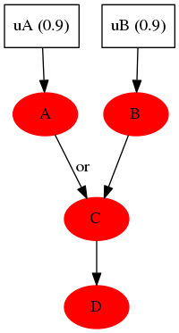
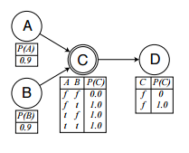

#### Background (story)

##### {{Weyland}} Lab

The {{Weyland}} Lab is studying hormones in rats.
They found four hormones in their rats and called them hormone A, hormone B, hormone C, and hormone D.

> In almost all of the mice, hormone A is present.
> 
> In almost all of the mice, hormone B is present.
> 
> The status of hormone C is caused by the status of hormones A and B and nothing else.
>
> If A is present, this always causes C to be present.
>
> If B is present, this always causes C to be present.
>
> The status of hormone D is caused by the status of hormone C and nothing else.
>
> If C is present, this always causes D to be present.
>
> {{Harold}} is a mouse from the {{Weyland}} Lab. You test {{Harold}} and find that:
>
> * Hormone A is definitely not present.
> * Hormone B is definitely not present.
> * Hormone C is definitely not present.
> * Hormone D is definitely not present.

#### Questions

* For {{Harold}} the mouse, if C were present, would A be present?
* For {{Harold}} the mouse, if C were present, would B be present?
* For {{Harold}} the mouse, if C were present, would C be present?
* For {{Harold}} the mouse, if C were present, would D be present?

#### L&K original findings

```{r echo=F, fig.width=5, fig.height=3}
data.frame(
  story = c('story4', 'story4', 'story4', 'story4'),
  labN.before.exclusion = 55,
  labN = 30,
  turkN.before.exclusion = 56,
  turkN = 34,
  condition = c('C=T', 'C=T', 'C=T', 'C=T'),
  variable = c('A', 'B', 'C', 'D'),
  data_response = frompixel(response.pixels=c(213, 207, 114, 116), pixel0=441, pixel1=105),
  data_sd = c(0), #participants were excluded if they said anything other than 0.
  model_response = frompixel(response.pixels=c(228, 228, 105, 105), pixel0=441, pixel1=105),
  model_sd = c(0)
) %>% graph(.)
```

#### Replication results

* For {{Harold}} the mouse, A is not present because <select>
  <option value="nothing">none of these</option>
  <option value="A">A is not present</option>
  <option value="B">B is not present</option>
  <option value="C">C is not present</option>
  <option value="D">D is not present</option>
</select>.
* For {{Harold}} the mouse, B is not present because <select>
  <option value="nothing">none of these</option>
  <option value="A">A is not present</option>
  <option value="B">B is not present</option>
  <option value="C">C is not present</option>
  <option value="D">D is not present</option>
</select>.
* For {{Harold}} the mouse, C is not present because <select>
  <option value="nothing">none of these</option>
  <option value="A">A is not present</option>
  <option value="B">B is not present</option>
  <option value="C">C is not present</option>
  <option value="D">D is not present</option>
</select>.
* For {{Harold}} the mouse, D is not present because <select>
  <option value="nothing">none of these</option>
  <option value="A">A is not present</option>
  <option value="B">B is not present</option>
  <option value="C">C is not present</option>
  <option value="D">D is not present</option>
</select>.

#### "Replication" with explanations

### Story 5: different strength causes

#### Causal structure

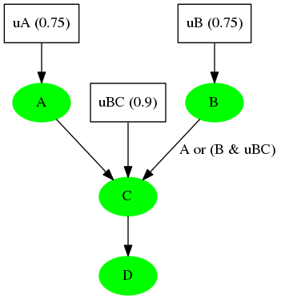
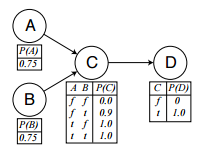

#### Background (story)

##### {{Snarp}} Lab

The {{Snarp}} Lab is studying hormones in rats.
They found three hormones in their rats and called them hormone A, hormone B, and hormone C.

> In many of the mice, hormone A is present.
>
> In many of the mice, hormone B is present.
>
> The status of hormone C is caused by the status of hormones A and B and nothing else.
>
> If hormone A is present, this always causes hormone C to be present.
>
> If hormone B is present, this almost always causes hormone C to be present.
>
> The presence of hormone D is caused by the presence of hormone C.
>
> If hormone C is present, this always causes hormone D to be present.
>
> {{Ilana}} is a mouse from the {{Snarp}} Lab. You test {{Ilana}} and find that:
>
> * Hormone A is definitely present.
> * Hormone B is definitely present.
> * Hormone C is definitely present.
> * Hormone D is definitely present.

#### Questions

* For {{Ilana}} the mouse, if C were absent, would A be present?
* For {{Ilana}} the mouse, if C were absent, would B be present?
* For {{Ilana}} the mouse, if C were absent, would C be present?
* For {{Ilana}} the mouse, if C were absent, would D be present?

#### L&K original findings

```{r echo=F, fig.width=5, fig.height=3}
data.frame(
  story = c('story5', 'story5', 'story5', 'story5'),
  labN.before.exclusion = 55,
  labN = 30,
  turkN.before.exclusion = 56,
  turkN = 34,
  condition = c('C=T', 'C=T', 'C=T', 'C=T'),
  variable = c('A', 'B', 'C', 'D'),
  data_response = frompixel(response.pixels=c(372, 305, 440, 373), pixel0=450, pixel1=114),
  data_sd = c(0), #participants were excluded if they said anything other than 0.
  model_response = frompixel(response.pixels=c(450, 305, 450, 450), pixel0=450, pixel1=114),
  model_sd = c(0)
) %>% graph(.)
```

#### Replication results

* For {{Ilana}} the mouse, A is present because <select>
  <option value="nothing">none of these</option>
  <option value="A">A is present</option>
  <option value="B">B is present</option>
  <option value="C">C is present</option>
  <option value="D">D is present</option>
</select>.
* For {{Ilana}} the mouse, B is present because <select>
  <option value="nothing">none of these</option>
  <option value="A">A is present</option>
  <option value="B">B is present</option>
  <option value="C">C is present</option>
  <option value="D">D is present</option>
</select>.
* For {{Ilana}} the mouse, C is present because <select>
  <option value="nothing">none of these</option>
  <option value="A">A is present</option>
  <option value="B">B is present</option>
  <option value="C">C is present</option>
  <option value="D">D is present</option>
</select>.
* For {{Ilana}} the mouse, D is present because <select>
  <option value="nothing">none of these</option>
  <option value="A">A is present</option>
  <option value="B">B is present</option>
  <option value="C">C is present</option>
  <option value="D">D is present</option>
</select>.

#### "Replication" with explanations

### Story 6: 

#### Causal structure


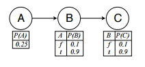

#### Background (story)

##### {{Wrean}} Lab

The {{Wrean}} Lab is studying hormones in rats.
They found three hormones in their rats and called them hormone A, hormone B, and hormone C.

> In some of the mice, hormone A is present.
>
> The status of hormone B is caused by the status of hormone A and nothing else.
>
> In almost all mice, if A is present, this causes B to be present, and if A is absent, this causes B to be absent. In the remaining mice, if A is present, this causes B to be absent, and if A is absent, this causes B to be present.
>
> The status of hormone C is caused by the status of hormone B and nothing else.
>
> In almost all mice, if B is present, this causes C to be present, and if B is absent, this causes C to
be absent. In the remaining mice, if B is present, this causes C to be absent, and if B is absent, this causes C to be present.
>
> {{Albert}} is a mouse from the {{Wrean}} Lab. You test {{Albert}} and find that:
>
> * Hormone A is definitely not present.
> * Hormone B is definitely not present.
> * Hormone C is definitely present.

#### Questions

* For {{Albert}} the mouse, if you had observed B to be present, would A be present?
* For {{Albert}} the mouse, if you had observed B to be present, would B be present?
* For {{Albert}} the mouse, if you had observed B to be present, would C be present?

#### L&K original findings

```{r echo=F, fig.width=5, fig.height=3}
data.frame(
  story = c('story6', 'story6', 'story6'),
  labN.before.exclusion = 55,
  labN = 30,
  turkN.before.exclusion = 56,
  turkN = 34,
  condition = c('B=T', 'B=T', 'B=T'),
  variable = c('A', 'B', 'C'),
  data_response = frompixel(response.pixels=c(206, 124, 278), pixel0=450, pixel1=114),
  data_sd = c(0), #participants were excluded if they said anything other than 0.
  model_response = frompixel(response.pixels=c(206, 114, 309), pixel0=450, pixel1=114),
  model_sd = c(0)
) %>% graph(.)
```

#### Replication results

* For {{Albert}} the mouse, A is not present because <select>
  <option value="nothing">none of these</option>
  <option value="A">A is not present</option>
  <option value="B">B is not present</option>
  <option value="C">C is present</option>
</select>.
* For {{Albert}} the mouse, B is not present because <select>
  <option value="nothing">none of these</option>
  <option value="A">A is not present</option>
  <option value="B">B is not present</option>
  <option value="C">C is present</option>
</select>.
* For {{Albert}} the mouse, C is present because <select>
  <option value="nothing">none of these</option>
  <option value="A">A is not present</option>
  <option value="B">B is not present</option>
  <option value="C">C is present</option>
</select>.

#### "Replication" with explanations

## ToDo

1. write down causal models and questions
2. code up experiment and run
3. get model predictions
4. compare ppl to model & replication to L&K